_本指南最初版本由 [@chestnut@m.cmx.im](https://m.cmx.im/@chestnut) 撰写，会不断完善。也欢迎在 [GitHub](https://github.com/neodb-social/about.neodb.social) 使用 pull request 提交修改，或者向 NeoDB 官方社交帐号（[Fediverse](https://mastodon.social/@neodb)、[BlueSky](https://bsky.app/profile/did:plc:ui2d3qu2ltydsyskmnuvi4ay)、[Twitter](https://twitter.com/NeoDBsocial)、[Discord](https://discord.gg/8KweCuApaK)）提出意见和建议。_

_2024.1.12: 更新文档以符合最新版本_

# NeoDB是什么

[neodb.social](https://neodb.social/) 是一个致力于为联邦宇宙居民提供一个自由开放互联的书籍、电影、音乐和游戏收藏评论空间。

NeoDB 以 AGPL-3.0 协议开源，源代码分叉自里瓣社区众筹开发的 NiceDB。

跟其他联邦宇宙应用一样，你可以[在此](https://neodb.fediverse.observer/list)查看所有 NeoDB 实例，其中除上文提到的 [neodb.social](https://neodb.social/) 外，[eggplant.place](https://eggplant.place/) 也是由 NeoDB 官方部署的实验站。

# NeoDB 使用指南

## 1. 如何注册并登录NeoDB？

NeoDB 目前支持多种注册账号的方式：能通过 Mastodon（或 Pleroma/Friendica/PixelFed 等任何支持 Mastodon API 的 Fediverse 应用）、BlueSky、Threads 的账号授权登录，也能直接使用电子邮件地址注册。  
如果你已有上述社交平台的账号，授权登录无疑是最简单的方法，但也推荐绑定电子邮件地址作为备用登录方式。

本章剩余内容将以 Mastodon 登录方式为例解释说明，若使用其他方式登录可直接跳到本文的[第 2 部分](#2-如何使用neodb)。

### 什么是Mastodon？

请点击以下文章了解Mastodon并根据教程选择实例注册账号，在此不再赘述。

- [《Mastodon（长毛象）使用讲解》](https://home.bangdream.space/mastodon-use/)by 炸邦裂梦乐团信息站
- [《长毛象 Mastodon 食用指南》](https://jings.blog/misc/how-to-use-mastodon.html) by Jing's Blog
- [《更加开放的社交网络，「长毛象」让你自由地分享想法》](https://sspai.com/post/46868) by i9NGbgNq@少数派
- [《去中心化开源社区Mastodon（长毛象）的使用详解 + 搭建安装教程》](https://blog.ysoup.org/tech/Mastodon.html) by YSOUP blog
- [Mastodon 中文官方文档](https://docs.joinmastodon.org/zh-cn/)

### 其他联邦宇宙？

Pleroma/Friendica/PixelFed实例同样运行在联邦网络上，与Mastodon相比用户数量略少，但各有独特有趣的功能， 这些实例之间是互联互通的，用户甚至可以在彼此间迁移。

在仔细阅读上面的文章之后，相信您已经拥有联邦宇宙实例的账号了！恭喜您来到联邦宇宙！

### 登录 NeoDB

1. 打开[NeoDB](https://neodb.social/)，点击蜘蛛网状的五边形图标，在展开的文本框内输入您所在实例的域名。（什么是实例域名？请查看[常见问题1](#1-获取实例域名)）
    

    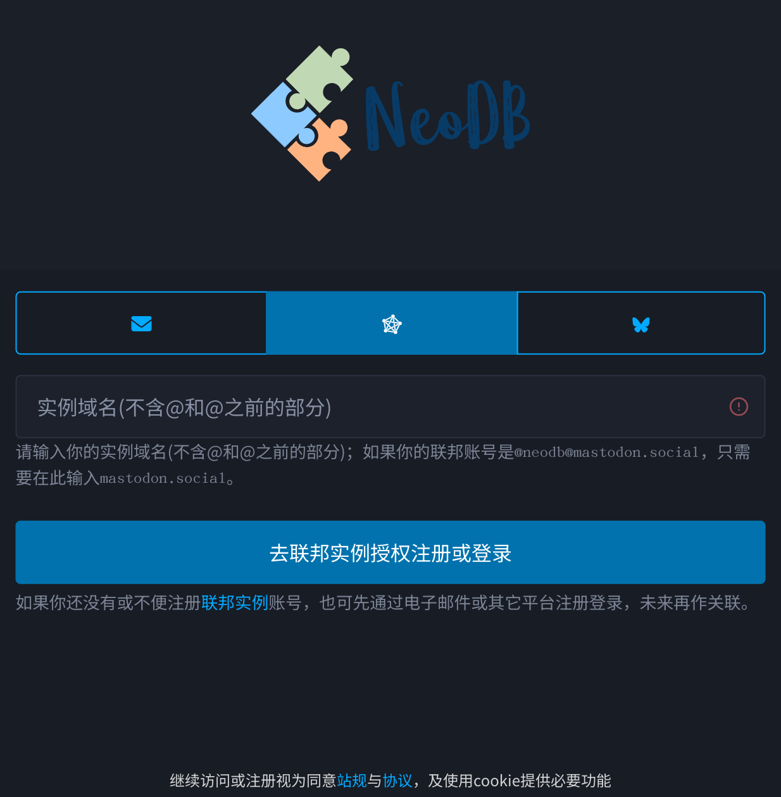

2. 点击授权登录，页面将跳转至Mastodon授权页面。
    
    
    
3. 若想使用 NeoDB，请点击同意授权，之后将跳转至基本信息填写页。权限用于：
    1. 查看账号信息：用于在NeoDB上显示你的账号信息。
    2. 查看你的关注：用于在NeoDB上显示你的关注信息。
    3. 以你的身份搜索：用于NeoDB确认你的被关注信息。
    4. 查看你的屏蔽列表：不在NeoDB上展示你的屏蔽列表中的用户发布的信息。
    5. 查看你的隐藏列表：不在NeoDB上展示你的隐藏列表中的用户发布的信息。
    6. 发表嘟文：在NeoDB记录信息时，可以选择同时发表嘟文到Mastodon等联邦宇宙。
    7. 上传媒体文件：发表嘟文时，将选择的媒体文件上传到嘟文中。
    
    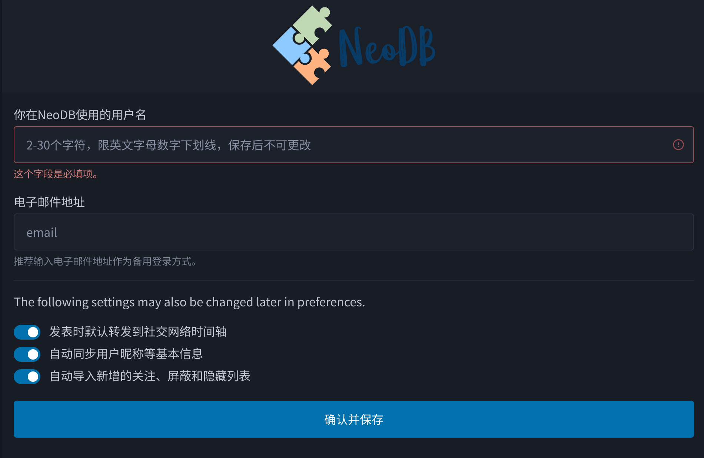

4. 填完基本信息并确认后进入说明页，请在仔细阅读说明页信息后，点击下方的“Cut the sh\*t and get me in!”按钮进入 NeoDB 首页。
5. NeoDB 还在不断开发中，为了您最好的体验，第一次登录NeoDB时，请仔细阅读右上角公告栏的信息（如下图）。
    
    
    

## 2. 如何使用NeoDB？

### 2.1 查询

在 NeoDB 页面上方输入想要查找的条目，敲击“回车”进行搜索。搜索结果的每个条目右上角有一个书签图标（下图划红线处），点击即可进行标记、评论。

或者点击条目封面或标题进入详情页，详情页面能查看其他用户的评分和评论，还支持添加到收藏单、写笔记等更多功能。

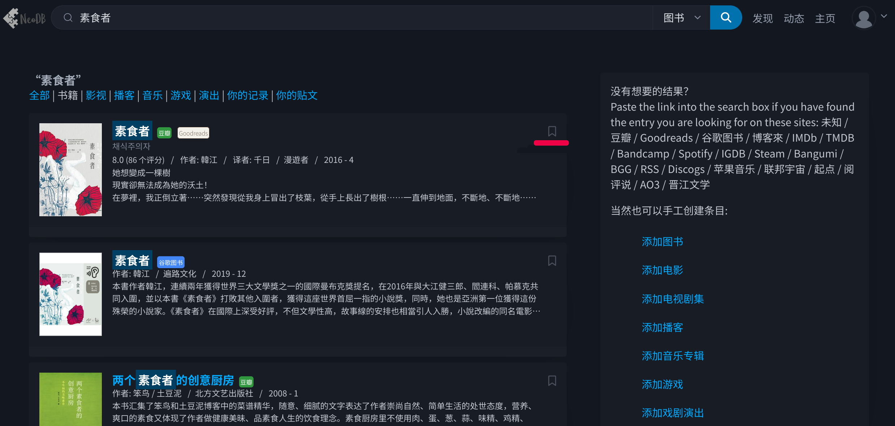

### 2.2 添加

如您想查找的条目不存在，欢迎您帮助补充 NeoDB 数据库！

如果您有条目在豆瓣 / Goodreads / 谷歌图书 / 博客來 / IMDb / TMDB / Bandcamp / Spotify / IGDB / Steam / Bangumi / BGG / RSS / Discogs / 苹果音乐 / 联邦宇宙 / 起点 / 阅评说 / AO3 / 晋江文学，可以直接在搜索栏里输入链接网址，回车即可自动导入。

如果连外站也找不到你想要的条目，则可以点击搜索结果页右侧的一列“添加图书”等按纽（上图），手动添加条目。

### 2.3 标记

以标记想读为例，在条目面详情页点击右上角的“想读”按钮，跳出标记弹窗。在弹窗中（下图）选择“分享到联邦网络”，即会在“提交”后，同时在联邦网络发布嘟文。

**标签**：为 NeoDB 内部的条目标签，与 Mastodon 的嘟文标签并不同。不需要使用“#”，回车后才算添加成功。  
如果你需要的是 Mastodon 的嘟文标签，直接在短评内使用“#”即可（语法一致）。
默认添加嘟文标签可通过 NeoDB 的设置页（见下图，点击右上角头像在下拉菜单中选择进入）进行修改。

**可见性**：与联邦网络意义一致。如需设置公开选项是否发布到公共时间轴，请通过 NeoDB 的设置页进行修改。

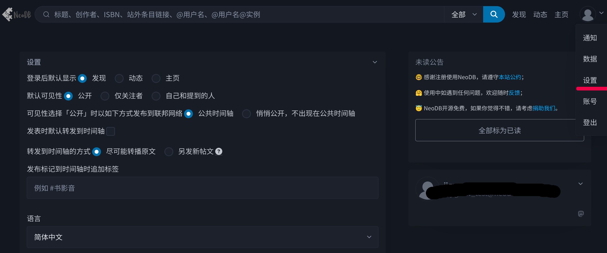

## 3. 如何导入其他网站的标记数据？

*此部分适用想从其他网站导入数据的用户，无此需求可跳过。*

点击右上角头像，在下拉菜单中选择“数据”选项，进入数据导入/导出页面。

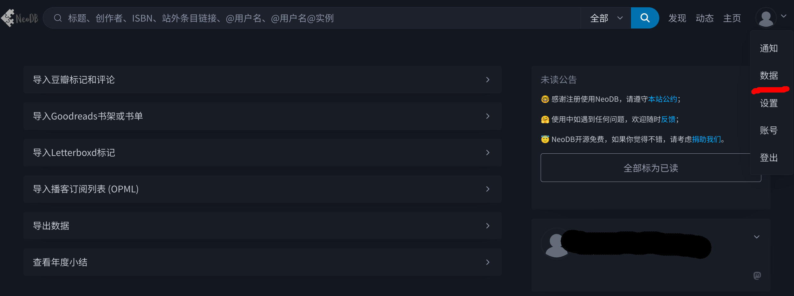

### 豆瓣（豆伴）

0. 首先准备好从[豆伴导出](../doufen/)的后缀名为.xlsx的豆伴备份文件。

1. 展开“导入豆瓣标记和评论”部分，进行自定义设置后，点击导入。
    1. 自定义设置说明：
    - “导入”：选择您的豆伴数据中包含的类别。（注：上传导入由[豆伴](https://github.com/doufen-org/tofu)（豆坟）导出的Excel文件，**请勿手动修改该文件**。部分条目由于需要登陆无法自动同步。）
    - “覆盖”：选择，如果某条目在NeoDB和豆伴文件中都存在时，您期望保留哪方的数据。在如果导入数据前，已经在NeoDB对条目进行过标记，选择“覆盖原有标记”会以豆伴文件的数据对条目重新进行标记，不选择则维持原有的标记。
    - 可见性：选择所同步的标记可见性是否为公开；对于已有的标记即便覆盖也不会改变可见性。

    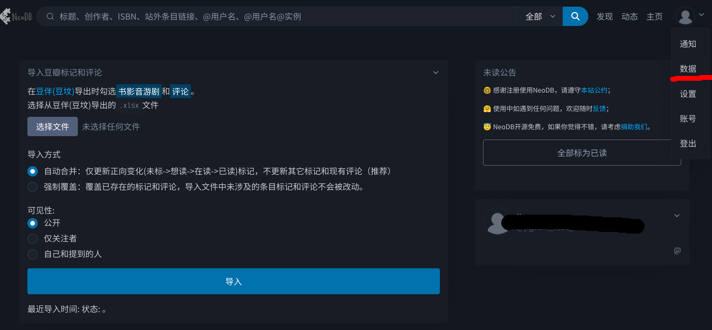
    
    b. 举例说明：
    
    - 导入前
        
        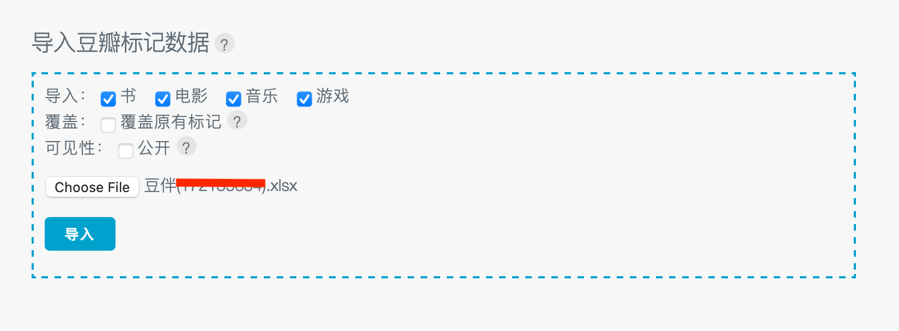
        
    - 导入中
        
        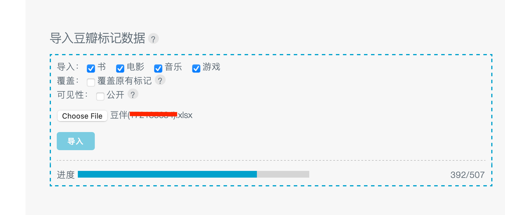
        
    - 导入后
        
        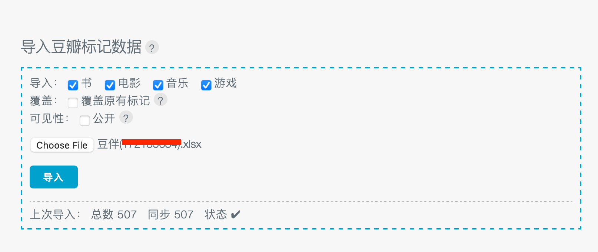
        
2. 点击右上角的“主页”，即可查看自己的标记数据。

### Goodreads

可通过NeoDB页面右上角的“数据”选项中的“导入Goodreads账号或书单进行操作”进行操作。

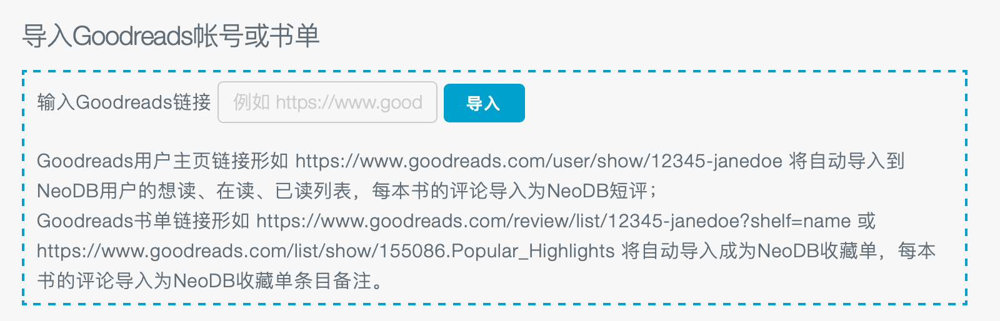

### LetterBoxd

TODO

### 播客（OPML）

0. 从你的播客客户端导出 OPML 格式的订阅列表（泛用型客户端一般都支持，Apple Podcast 可参考[如何把Apple Podcast的订阅列表导入到其它播客apple](https://haroldgao.com/zh-cn/post/opml/)）
1. 展开 NeoDB 的“导入播客订阅列表 (OPML)”界面，选择文件导入。

## 4. 如何导出 NeoDB 上的个人数据？

可通过 NeoDB 页面右上角的“数据”选项中的“导出个人数据”进行操作。

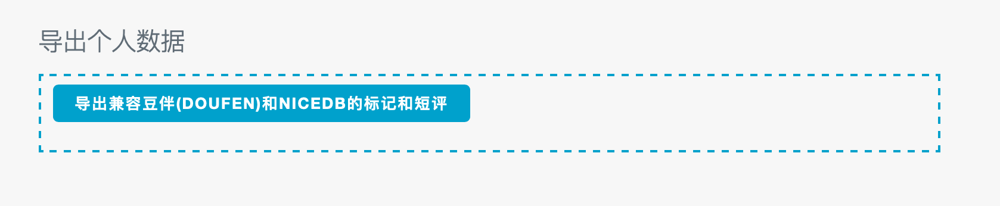

## 5. 如何删除NeoDB上的个人数据？

可通过 NeoDB 页面右上角头像展开的“账号”选项进入账号页面，在该页面展开最下方的“删除账号”进行操作。

在输入框中，输入您的用户名@实例名，如user@mostodon.social，点击“永久删除”即可。删除操作无法撤销，请按需在删除前对NeoDB信息进行导出备份。

_由于联邦宇宙的特殊性，极小数实例可能不会按 NeoDB 的联邦网络删除广播删除您的数据，此行为 NeoDB 官方无法控制。_

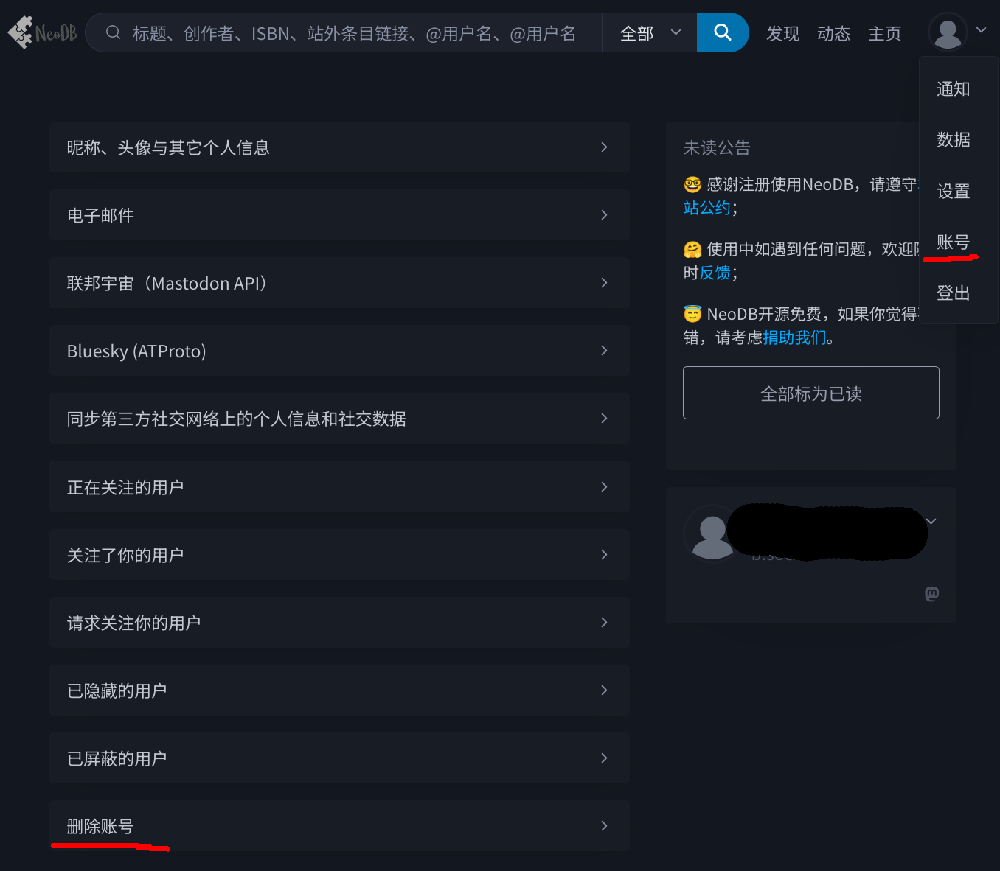

# 常见问题

## 1. 获取实例域名

### 什么是实例域名？

每个Mastodon实例都拥有自己的域名，也就是能访问到该实例的网站。以mastodon.social为例，用户可以通过 [https://mastodon.social/](https://mastodon.social/) 地址进入到这个实例的首页。

### 如何获取所在实例域名？

每个账户的后缀即是实例域名，可以通过以下方式进行查看：

1. 点击自己的头像，进入账号主页；
2. 在自己的名字下面的以“@”开头的一串字母即是自己的账号；
3. 实例域名是第二个“@”后面的一串字母，以下图为例，实例域名为“mastodon.social"。
    
    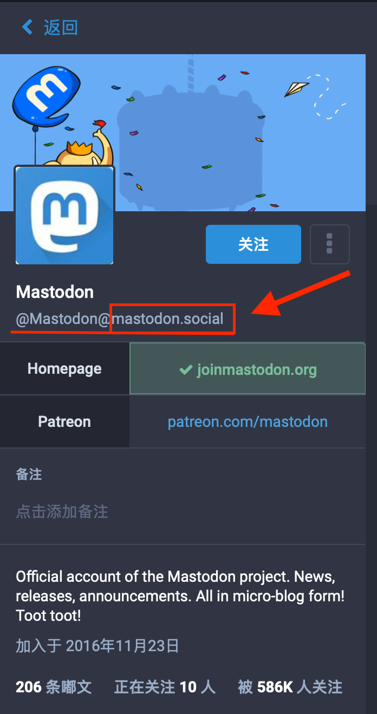

少数实例提供多个辅助网址方便翻墙用户使用，取决于站长的设置，部分翻墙用的域名部分也能用于登录NeoDB，但如果您在用这些辅助域名登录时遇到困难，请使用主域名登录。
