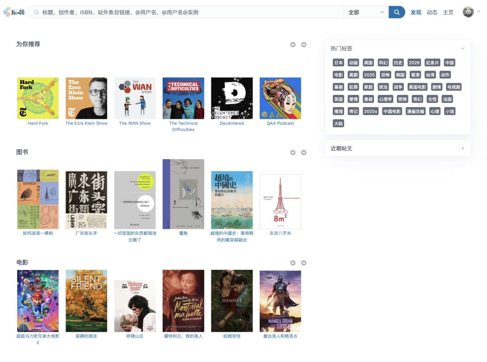
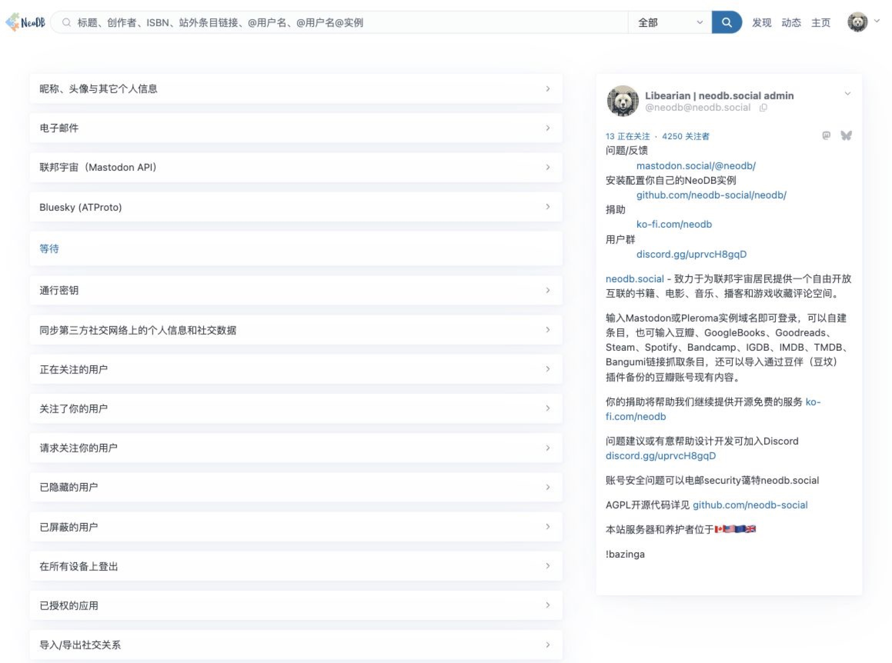
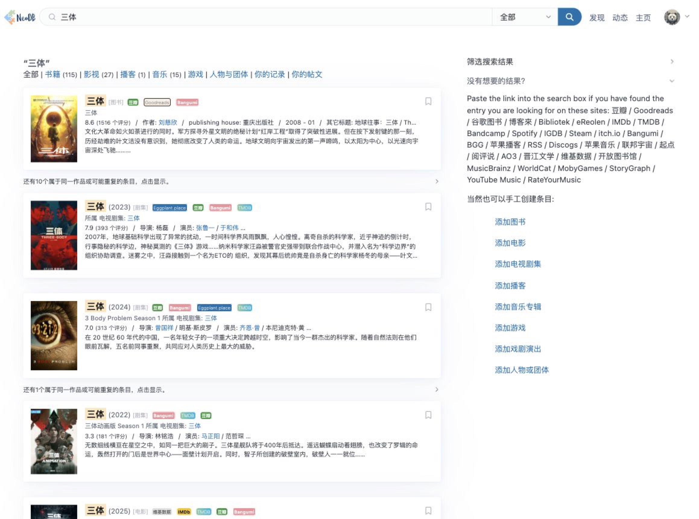
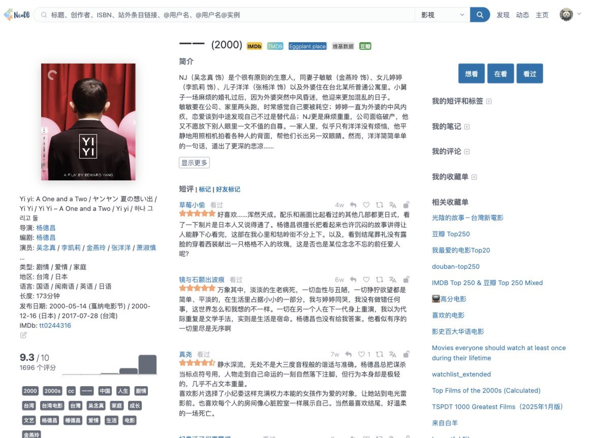
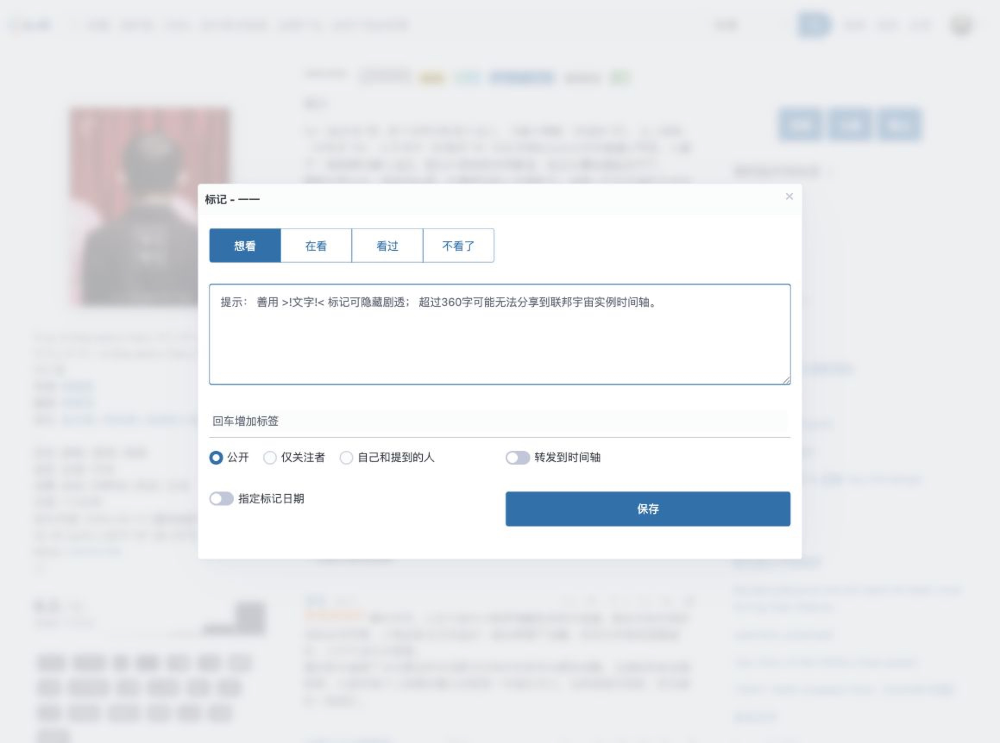

NeoDB 是一个开放、互联的书影音游播客收藏与评论空间。你可以把它理解成一个更自由的文化产品数据库：找书、电影、剧集、音乐、游戏、播客和演出，记录自己的进度、评分、短评、评论和笔记，也可以通过联邦宇宙和 Bluesky/ATProto 把这些记录分享给朋友。

[neodb.social](https://neodb.social/) 是 NeoDB 开发者维护的公共实例。你也可以使用其他 NeoDB 实例，或在需要时自建实例；不同实例之间通过开放协议互联。

## NeoDB 能做什么

NeoDB不是“又一个打分网站”和围墙花园，而是把你的文化生活记录放在一个更易用和互联的地方。

你可以用它做这些事：

- 建立自己的书影音游播客档案：想读、在读、已读，想看、在看、看过，想玩、在玩、玩过等。
- 写短评、长评、笔记和标签；标签可以公开，也可以只给自己整理用。
- 创建收藏单，例如“今年读完的小说”“想补的科幻电影”“适合通勤听的播客”。
- 从豆瓣、Goodreads、StoryGraph、Letterboxd、RateYourMusic、Steam、播客 OPML 等来源导入旧数据。
- 在动态页看到朋友的标记、评论和帖子；符合条件的播客和音乐条目还可以直接播放。
- 像传统社交网络或博客系统一样发帖：微博和长文都可以，不一定要围绕某个条目。
- 用 Fediverse 或 Bluesky/ATProto 身份登录和同步社交关系，也可以把公开记录同步到这些网络。

## 注册和登录

打开 [neodb.social](https://neodb.social/)，点击页面上的注册或登录入口。NeoDB 当前常见的登录方式包括：

- 电子邮件注册。
- 使用 Fediverse 身份登录，例如 Mastodon、Pleroma、Firefish、GoToSocial、Pixelfed、Friendica、Takahē 等。
- 使用 Bluesky/ATProto 身份登录。

如果你已经有 Mastodon 或 Bluesky 账号，用它们授权登录很方便；不过第一次进入 NeoDB 后，建议马上去 `账号` 页面绑定电子邮件，或添加 `通行密钥`（passkey）作为备用登录方式。

这个步骤很重要：如果你的 Mastodon 实例临时故障、账号丢失、Bluesky 应用密码失效，或者上游账号无法完成授权，你仍然可以通过电子邮件或通行密钥回到 NeoDB。

## 基本使用

登录后先看顶部导航：

- `发现`：浏览系统推荐和不同类型的热门条目。
- `动态`：查看朋友活动，可以在“全部”和“仅书影音”之间切换。
- `主页`：查看自己的标记、评论、收藏单和个人资料。
- 头像菜单：进入 `数据`、`设置`、`账号`、`通知` 等页面。

最简单的开始方式是：

1. 在顶部搜索框输入一个标题、创作者、ISBN、外站条目链接，或用户地址。
2. 进入条目页，先点 `想读`、`想看`、`想玩` 之类的按钮，把它放进自己的记录。
3. 看完、读完、听完或玩完后，改成完成状态，补上评分、短评、评论或笔记。
4. 在 `动态` 页关注朋友的记录，也可以从条目页发现相关收藏单和其他评论。
5. 如果只是想发一段近况、照片或长文，可以直接像使用微博或博客一样发布帖子。

## 搜索条目

NeoDB 的搜索框比普通标题搜索更有用。你可以输入：

- 标题、原名、译名。
- 作者、导演、演员、音乐人、播客名、游戏名。
- ISBN。
- 外站条目链接，例如豆瓣、Goodreads、IMDb、TMDB、Bangumi、Steam、Spotify、Apple Music、Bandcamp、BoardGameGeek、AO3、Open Library、WorldCat、MusicBrainz，或播客 RSS。
- 用户地址，例如 `@用户名` 或 `@用户名@实例`。

搜索结果里常见的信息包括：

- 条目类型：图书、电影、剧集、播客、音乐、游戏、演出、人物与团体等。
- 外部来源标签：例如 Douban、Goodreads、IMDb、TMDB、Bangumi、Spotify。
- 年份、作者、导演、演员、出版社等摘要信息。
- 右侧的手动创建入口：如果没有找到合适条目，可以新建图书、电影、剧集、播客、音乐专辑、游戏、演出或人物/团体。

如果搜索结果里有多个同名条目，优先看类型、年份、封面和外部来源标签。图书还要注意不同译本、不同出版社、纸书和电子书可能是不同版本。

## 标记、评分和写记录

进入条目页后，你会看到条目封面、元数据、评分、简介、其它版本、短评、评论、笔记和相关收藏单。

登录状态下，条目页会显示与你相关的记录入口：

- 状态：想读/在读/已读，想看/在看/看过，想听/在听/听过，想玩/在玩/玩过等。不同类型的条目会使用不同文案。
- 评分：给条目打分。
- 短评和标签：适合写一句话感想，也适合给自己整理分类。
- 笔记：可以记录阅读页码、播放进度、章节或其它过程中的想法。
- 评论：适合写更完整的长文。
- 收藏单：把条目加入一个公开或私密的列表。

发布时注意两个选择：

- `可见性` 决定这条记录谁能看到，通常包括仅自己、关注者可见、公开等选项。具体以页面显示为准。
- `分享到社交网络` 会把记录同步到你关联的 Fediverse 或 Bluesky/ATProto。只是给自己整理时，可以关掉同步。

如果同步失败，头像菜单里的 `等待` 页面会列出待重试或需要处理的跨站发布。

## 找不到条目怎么办

如果 NeoDB 里没有你要找的条目，先试试把外站链接直接贴进搜索框。NeoDB 可以从很多站点导入条目元数据，常见来源包括：

- 图书：豆瓣、Goodreads、Google Books、Open Library、WorldCat、博客来、起点、阅评说、AO3、晋江文学城等。
- 影视：IMDb、TMDB、豆瓣、Bangumi、Wikidata 等。
- 音乐：Spotify、Apple Music、Bandcamp、Discogs、MusicBrainz、豆瓣等。
- 游戏：Steam、IGDB、BoardGameGeek、Bangumi、豆瓣等。
- 播客：Apple Podcasts 或任意 RSS 链接。

如果外站也没有，搜索结果页右侧可以手动创建条目。创建前尽量确认：

- 条目类型是否正确。
- 标题、年份、作者/导演/创作者是否足够明确。
- 是否已经存在同一作品的其它版本。

NeoDB 没有传统意义上的中心化审核队列，普通登录用户也可以编辑条目元数据。看到明显错误时，可以参考[条目编辑说明](../metadata/)协助修正。

## 导入旧数据

如果你已经在其他网站记录了很多内容，不需要从零开始。点击头像菜单里的 `数据`，可以找到导入和导出入口。

常见导入来源：

- 豆瓣：通过[豆伴](../doufen/)导出的备份文件导入标记和评论。
- Goodreads：导入阅读列表。
- StoryGraph：导入阅读列表。
- Letterboxd：导入观影列表。
- RateYourMusic：导入音乐收藏。
- 播客客户端：导入 OPML 订阅列表。
- Steam：导入游戏库。

导入前建议先想清楚三件事：

- 是否覆盖 NeoDB 里已有的标记。
- 导入后的可见性是公开、关注者可见，还是仅自己可见。
- 是否需要把导入产生的记录同步到社交网络。

NeoDB 也支持导出个人数据，常见格式包括 CSV 和 NDJSON。迁移、备份或批量整理之前，先导出一份会安心很多。

## 社交、关注和可见性

NeoDB 本身也是一个社交站点。你可以关注 NeoDB 用户，也可以通过 ActivityPub 与 Mastodon、Pleroma 等 Fediverse 用户互动。NeoDB 还支持 Bluesky/ATProto 身份关联，并可把公开内容发布到对应网络。

除了围绕条目标记、评分和评论，你也可以直接发布普通帖子。微博和长文都可以进入动态流；如果你把 NeoDB 当作一个带书影音档案的博客或社交主页来用，也完全说得通。

几个新用户容易混淆的点：

- `动态` 是朋友活动流，不只是评论区。
- 条目标记、短评、评论和普通帖子都可以设置可见性。
- 公开记录可能被其它 NeoDB 实例或联邦网络里的其它实例看到。
- 关联 Mastodon 或 Bluesky 后，可以同步个人资料和社交关系，但取消关注、屏蔽、隐藏等变更不一定会自动反向清理，必要时需要手动整理。

可以在 `设置` 页面调整主题、专注模式、去度量化、每页条目数、默认同步和默认标签等偏好。专注模式会减少来自他人的评分和评价干扰，适合只想查资料或整理自己记录的时候。

## 常见问题

### NeoDB 和豆瓣、IMDb、Goodreads 是什么关系？

NeoDB 不是这些网站的镜像，也不依赖单一数据源。它会从外部站点导入或关联元数据，让你更容易找到已有条目；你的标记、评论、标签和收藏单则保存在 NeoDB 账号里。

### NeoDB 和长毛象有什么异同？

NeoDB 和长毛象（Mastodon）都在联邦宇宙里：你可以关注用户、发布帖子、回复、点赞、转发，也可以为内容设置公开、关注者可见或更私密的可见性。NeoDB 用户也能和 Mastodon、Pleroma 等 ActivityPub 服务上的用户互动。

它们的中心不太一样。长毛象更像微博式时间线，核心是发帖和阅读关注者动态；NeoDB 则更像“书影音游播客档案 + 社交网络”，核心是条目、标记、评分、短评、长评、笔记、收藏单和数据导入导出。NeoDB 也能像长毛象或博客一样发短帖、照片和长文，但它多了一层围绕文化条目的结构化记录。

如果你主要是记录书影音，偶尔发微博或文章，你可以考虑只注册NeoDB实例使用，和联邦网络上包括长毛象在内的各类实例的用户互通。

如果你用长毛象发微博比较多，但是偶尔想把书影音记录也转发到长毛象上，那可以用长毛象账号登录或关联 NeoDB 实例并同步社交关系和设置转发。

### 什么是实例？

实例就是一台运行 NeoDB 的服务器。`neodb.social` 是开发者维护的公共实例，但 NeoDB 是开源软件，也可以部署在其他域名。实例之间可以通过开放协议交换公开信息。

### 我应该选 neodb.social 还是其他实例？

刚开始使用可以选 `neodb.social`，因为它资料最多、维护最活跃。以后如果你更在意某个社区、语言、管理规则或自托管，也可以考虑其他实例。

### 为什么同一本书或同一部电影有多个条目？

有时是不同版本，例如译本、出版社、电子书、剧集分季、重制版；有时则是外站导入时还没自动合并。不要急着合并，先判断它们是否真的代表同一条目。处理元数据问题请看[条目编辑说明](../metadata/)。

### 可以删除账号吗？

可以。在 `账号` 页面底部可以找到删除账号入口。删除前请先去 `数据` 页面导出备份。由于联邦网络的传播机制，远端服务器是否完整删除已经收到的公开内容，不完全由 NeoDB 控制。

### 开发者可以接入 NeoDB 吗？

可以。NeoDB 提供 OpenAPI/Swagger 形式的接口文档，公共实例的开发者入口在 [neodb.social/developer/](https://neodb.social/developer/)。NeoDB 也支持一部分 Mastodon 兼容 API。

## 下一步

- 先用搜索框找三五个你最近读过、看过、听过或玩过的条目，完成第一批标记。
- 如果你来自豆瓣、Goodreads、StoryGraph、Letterboxd、RateYourMusic、Steam 或播客客户端，再去 `数据` 页面导入历史记录。
- 如果你关心数据质量，读一遍[条目编辑说明](../metadata/)，遇到错误条目时顺手修一下。
- 如果你想写工具或客户端，看 [NeoDB API](../api/) 和 [开发者接口](https://neodb.social/developer/)。

更多官方资料可以参考 [NeoDB 功能介绍](https://neodb.net/features/)、[公共服务器列表](https://neodb.net/servers/)、[应用列表](https://neodb.net/apps/) 和 [源代码仓库](https://github.com/neodb-social/neodb)。

## 致谢

感谢 [@chestnut@m.cmx.im](https://m.cmx.im/@chestnut) 和 [@jigsaw@wxw.moe](https://wxw.moe/@jigsaw) 曾为 NeoDB 中文文档做出的重要贡献和补充。新版指南基于这些早期工作继续整理和更新。
