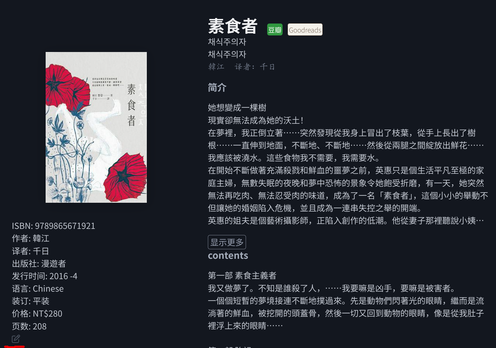

# NeoDB 收录情况

NeoDB 目前支持图书（含网络小说、同人作品）、影视、音乐、游戏（含桌游）、演出、播客类型的条目。

- Movie(电影）
- TVShow（电视剧系列）
  - TVSeason（电视剧分季）
    - TVEposide（电视剧分集
- Work（著作）
  - Edition（图书）
- Album（专辑）
- Game（游戏）
- PerformanceProduction（演出剧本）
  - Perfomance（演出）
- Podcast（播客）

待实现的类型：

- Series（丛书）
- People（现实人物）

## 上游站列表

NeoDB 能从其他网站导入条目，这些网站称作**上游站**，导入后会在条目标题的右侧显示上游站标签。

| 上游站|中文元数据|导入方式|可导入的类型|
|-|-|-|-|
| [IMDB](https://www.imdb.com/)|❌|网页|Movie、TVShow、TVSeason、TVEpisode|
| [TMDB](https://www.themoviedb.org/?language=en-US)|✅|API|Movie、TVShow、TVSeason、TVEpisode|
| [豆瓣](https://www.douban.com/)|✅|网页|Edition、Work、Movie、TVSeason、Album、Game、Perfomance、PerformanceProduction|
| [Bangumi](https://bgm.tv)|✅|API| Edition、Movie、TVSeason、Album、Game
| [Goodreads](https://www.goodreads.com/)|🤗[^1]|网页|Edition、Work|
| [谷歌图书](https://books.google.com/)|🤗[^2]|API|Edition、Work|
| [起点中文网](https://www.qidian.com/)|✅|网页|Edition|
| [阅评说](https://www.ypshuo.com/)|✅|非开放API|Edition|
| [AO3](https://archiveofourown.org/)|🤗[^3]|网页|Edition|
| [晋江文学城](https://www.jjwxc.net/)|✅|非开放API|Edition
| [博客來](https://www.books.com.tw/)|✅|网页|Edition
| [Steam](https://store.steampowered.com/)|🤗[^4]|API|Game|
| [IGDB](https://www.igdb.com/)|❌|API|Game|
| [BoardGameGeek](https://boardgamegeek.com/)|❌|网页|Game|
|[Apple Music](https://music.apple.com/)||网页|Album|
|[Bandcamp](https://bandcamp.com/)||网页|Album|
|[Discogs](https://www.discogs.com/)||API|Album|
|[Spotify](https://open.spotify.com/)||API|Album|
|[ApplePodcast](https://podcasts.apple.com/us/browse)||API|Podcast|

[^1]: Goodreads：与图书出版语言相关
[^2]: 谷歌图书：良莠不齐
[^3]: AO3：与文章的语言相关
[^4]: Steam：有些游戏开发商没有填中文元数据

音乐平台 TODO

## 自动合并

NeoDB 条目有一项“主要标识数据”的字段（对图书一般是 ISBN、对影视来说一般是 IMDB_id），如果 NeoDB 在导入外站条目时检测到已存在同标识数据的条目，会将其自动合并到现有条目。

- TVSeason、Movie
  - 豆瓣、IMDB、TMDB: 互相之间靠 imdb_id 能自动合并
    - bangumi: 三次元条目大部分有 imdb_id（出错概率极大，建议不要导入），动画大部分需要手动合并
- Edition：大部分出版物有 ISBN 就能合并
  - 起点/阅评说/晋江：大部分阅评说条目能分别与起点、晋江条目合并。
- Game：大部分情况下需手动操作
  - IGDB、Steam 之间能自动合并
- Album: 待补充

# 条目编辑

NeoDB 不存在审核机制，所有登录用户均可在条目详情界面左下角（上图红色标记处）点击铅笔图标进入元数据编辑界面。

左侧界面可手工填写元数据，右侧界面为编辑选项界面，建议在阅读完本章之前不要点击编辑选项中的任何按钮。

## 编辑选项

点击右上角的的🕒图标可查看条目编辑历史

点击任一“外部网站”按钮可展开“重新获取”按钮，其功能为从上游站重新获取条目元数据并覆盖现有数据，所以在点击此按钮前，请提前确认该上游站的元数据是否错误。

### 合并条目

NeoDB 导入条目时并不都能自动合并，很多时候需要用户手动合并条目。点击“合并”按钮展开合并界面，在输入框中填入目标条目的链接后点击“合并到另一条目”即可。

注意合并条目并不会合并元数据，而只是将原条目的链接重定向到另一条目并移动上游站标签至目标条目。假设在 A 条目的合并界面填入 B 条目，合并成功后你就只能搜索到 B 条目。

普通用户仅可将未被标记（仅有用户本人标记也不行）的条目合并到其他条目，如有合并两个已被标记条目的需求请使用[修改建议](#修改建议)。

常见的合并误区：

- 同一书籍的不同出版版本（ISBN 不同）应使用[关联](#关联条目)而非合并
- 同一游戏的重制版与原版是不同的游戏，不应合并
- 同一季日本动画分割放送的两部分，不应合并

### 关联条目

TvSeason（分季）条目可以关联到 TvShow（系列）。注意：豆瓣本身没有 TVShow 条目，与其关联到其他上游站导入的 TVShow 不如合并到 TMDB/IMDB 的 TVSeason。

Edition 可以关联到另一本 Edition，这样二者的短评可以互通。适用范围：原著与不同译本。

### 修改建议

当遇到普通用户权限无法处理的操作时（合并两个已标记条目、取消错误合并），可以在“修改建议”界面提交建议，建议会被发送到[Discord 条目管理板块](https://discord.com/channels/1041738638364528710/1202807627684380702)供管理员参考。

目前可在[Discord](https://discord.gg/8KweCuApaK)申请旗舰站（neodb.social、eggplant.place）的条目管理员。**请勿滥用管理权限，如有不确定的操作请在相关帖子与他人讨论，否则后果自负。**

# 常见问题

## 无法合并不同类型的条目

多见于影视类合并，有些网站（如 Bangumi）的 TvSeason 在导入时可能会错误识别成 Movie，需要用户手动在编辑界面点击“切换分类”按钮将其改为正确的分类。

## locallized_title error

目前是由 Bangumi 导入图书所引发的 bug，暂时的解决方案是删去多余的 locallized_title。

# 附录：元数据字段

## Edition（图书）

- original_title 原标题 多出现于翻译作品
- locallized_title 本地化标题：当地出版时用的标题
- other_title
- localized_subtitle 副标题
- author 作者
- format 格式（平装、）
- pub_house 出版社
- pub_month
- pub_year
- language
- translator 译者
- series
- imprint 出品方
- binding 装订
- pages
- price
- index
- localized_description 简介

## TVSeason（电视剧分季）/Movie（电影）

二者字段基本一致

TODO

## Game（游戏）

TODO
